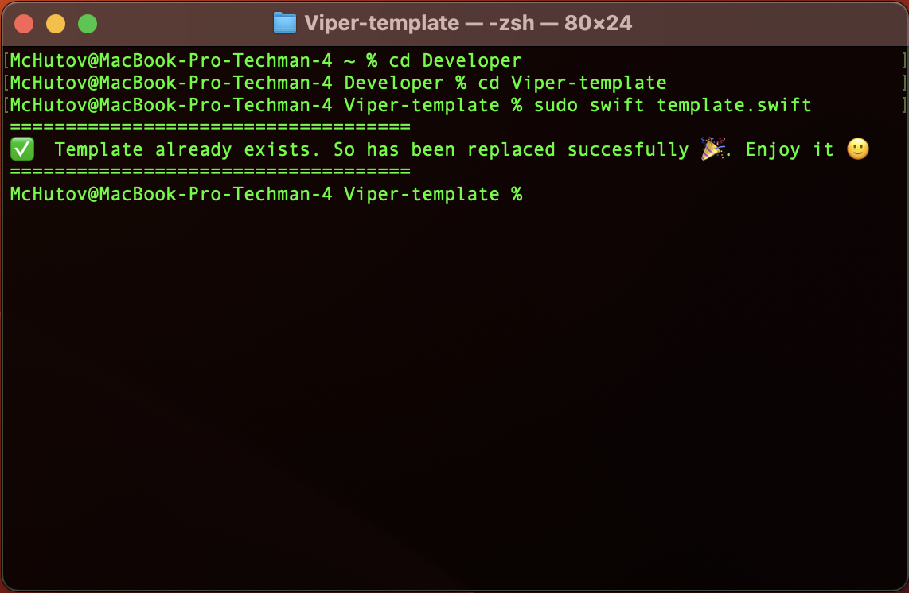
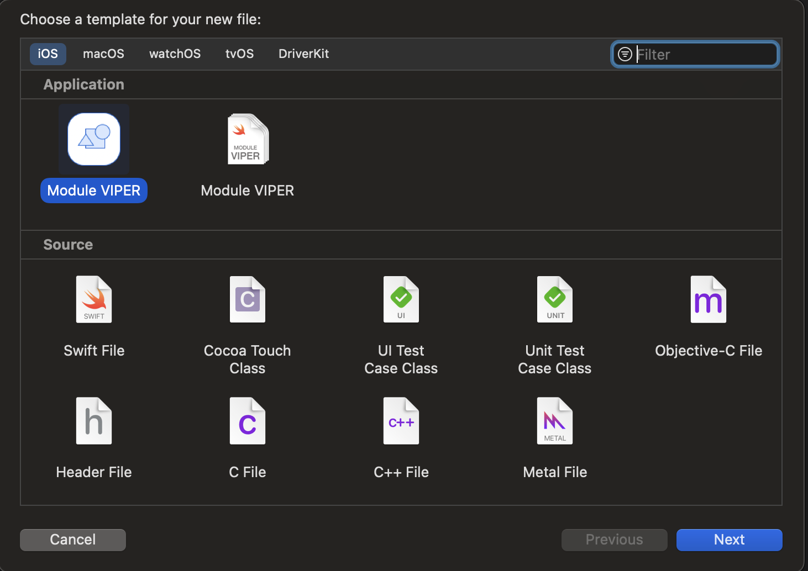
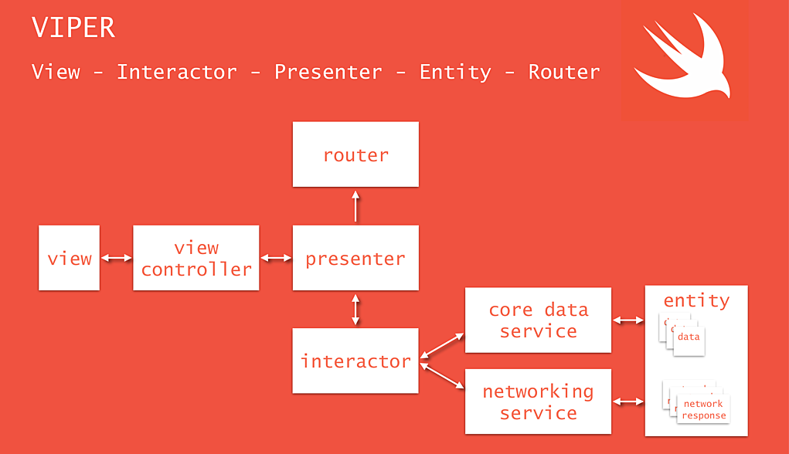

Because Viper has a lot of additional files and code. It often happens that you have to spend a lot of time creating all this. This template is designed to make this routine easier.

## How to install

### Using terminal
In the template folder, execute command below:
```swift
sudo swift template.swift
```
You should be this output message:



If everything is ok. Then you can find your template in Xcode:



### Manual
Go to Application folder, browse to the Xcode application icon. Right-click it and choose 'Show Package Contents'. Then browse to:
`Contents/Developer/Platforms/iPhoneOS.platform/Developer/Library/Xcode/Templates/Project Templates/iOS/Application` and add "Module VIPER.xctemplate" file. Now you can find your template in Xcode.

## VIPER diagram overview


## References
- [iOS Architecture Patterns](https://medium.com/ios-os-x-development/ios-architecture-patterns-ecba4c38de52#.ba7q8dcih)
- [#8 VIPER to be or not to be?](https://swifting.io/blog/2016/03/07/8-viper-to-be-or-not-to-be/)
- [Архитектура VIPER для IOS приложений/](https://medium.com/maddevs-io/arhitektura-viper-dlya-ios-prilozhenij-9691a653b8d7)
- [Разбор архитектуры VIPER](https://habr.com/ru/articles/358412/)

## Author

* Dastan Makhutov [🐦](https://www.twitter.com/juanpecmios)
